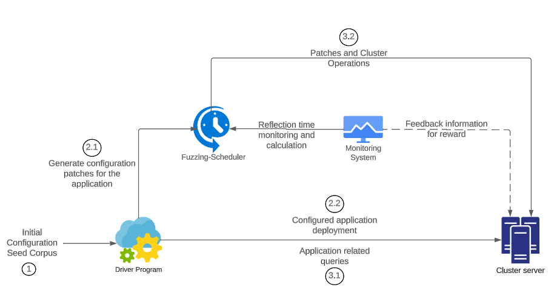

# Fuzzing Cloud PaaS Platforms

### Description

Container-based cloud platforms provide scalability, efficiency, and reliability which made them developed or adopted by many Information Technology organisations. Minimised capital and operation cost, interoperability, compatibility, auto-elasticity on-demand availability of resources, ability to run on multiple platforms and multiple browsers, quicker to market, and multi-tenancy are the benefits of container-based PaaS cloud systems that created the path for increasing usage. However, this higher demand also leads to potential challenges such as security issues, elasticity issues, high availability issues, and multi-tenancy issues. Any vulnerabilities or bugs in these platforms can have wide-ranging and severe consequences for the services they support. Therefore, these issues have to be taken into account and solved before releasing these high-quality solutions to the customers and market.

Kubernetes stands as the forefront and preeminent container orchestration tool, proficiently overseeing containerized applications spanning multiple hosts. Numerous enterprises have constructed their Platform as a Service (PaaS) offerings atop Kubernetes, underscoring its pivotal role in the contemporary cloud landscape. Although Kubernetes does not qualify as a PaaS product, it serves as a foundational technology for developing PaaS applications, exemplified by platforms like Openshift. Given the widespread adoption of Kubernetes, a comprehensive examination and analysis of fixed and outstanding bugs within the Kubernetes ecosystem assume paramount significance in research and evaluation.

Developing a fuzzing framework for testing the scheduler module of container orchestration tools is crucial, given the increasing usage of orchestration tools in the industry and the evolving nature of the scheduler module. The absence of a dedicated fuzzer for the scheduler module in container orchestration tools and PaaS systems underscores the project’s importance. It not only plays a vital role in evaluating these tools but also opens avenues for future developments in the domain.

### Commands

`minikube start --extra-config=kubelet.allowed-unsafe-sysctls=net.core.somaxconn`

### Setup
Find the attachment in the `./setup guide` directory

### Methodology

### Contributors

Principal Investigators:

- [Dr. Sunimal Rathnayake](https://sunimalr.staff.uom.lk) - University of Moratuwa  
- [Dr. Ridwan Shariffdeen](https://rshariffdeen.com) - National University of Singapore  

Developers:

- [Kabilan Mahathevan](https://github.com/KabilanMA)  
- [Tharsha Sivapalarajah](https://github.com/Tharsha-Sivapalarajah)  
- [Sivakajan Sivaparan](https://github.com/sivakajan-tech)  
